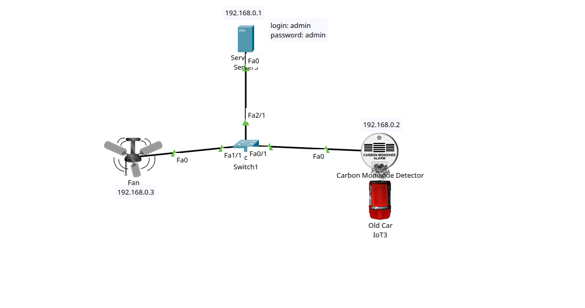
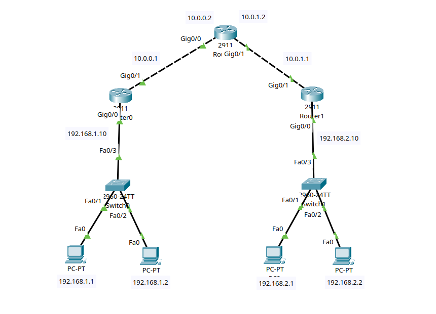
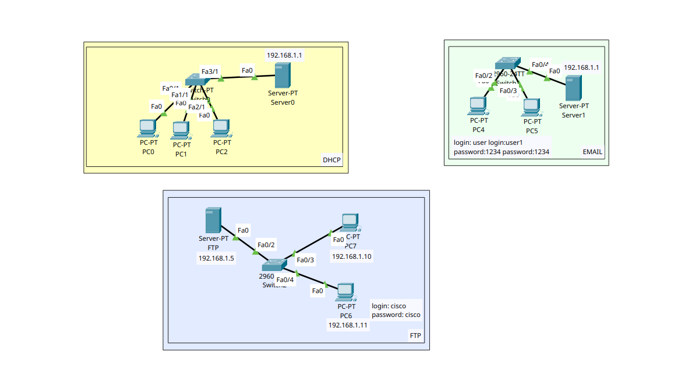

# 01. VLAN Configuration on a Cisco Switch (Packet Tracer)

This project demonstrates secure LAN segmentation on a Cisco switch using Virtual Local Area Networks (**VLANs**). Instead of using the default and insecure VLAN 1, the network has been divided into two independent VLANs: **VLAN 10 (Office)** and **VLAN 20 (Guests)**.

---

## 📐 Network Topology

Below is the visual network topology diagram showing the connections between the PCs and the switch, created in Cisco Packet Tracer:


### Addressing and Port Assignment Table:

| Device | Switch Port | Department / Purpose | VLAN | IP Address | Subnet Mask |
| :--- | :--- | :--- | :---: | :--- | :--- |
| **PC0** | FastEthernet 0/1 | Office | **10** | `192.168.1.1` | `255.255.255.0` |
| **PC1** | FastEthernet 0/2 | Office | **10** | `192.168.1.2` | `255.255.255.0` |
| **PC2** | FastEthernet 0/3 | Guests | **20** | `192.168.1.3` | `255.255.255.0` |
| **PC3** | FastEthernet 0/4 | Guests | **20** | `192.168.1.4` | `255.255.255.0` |

---

## 🛠️ Configuration Guide (CLI Script)

To replicate this configuration, log into the switch's Command Line Interface (**CLI**) and execute the following commands:

### Creating and Configuring VLAN 10 and VLAN 20
```text
enable
configure terminal

vlan 10
name Office
exit

interface range fastEthernet 0/1 - 2
switchport mode access
switchport access vlan 10
no shutdown
exit

vlan 20
name Guests
exit

interface range fastEthernet 0/3 - 4
switchport mode access
switchport access vlan 20
no shutdown
exit
```
### 💾 Saving the Configuration
After separating the devices into different VLANs, save the data permanently to non-volatile memory (NVRAM) with this command:
```text
do write memory
```

# 02. Basic Inter-Subnet Routing via Cisco Router (Packet Tracer)

This project demonstrates how to connect two separate Local Area Networks (LANs) using a Cisco Router as a Default Gateway. The network is divided into two distinct subnets: `192.168.1.0/24` (left side) and `192.168.2.0/24` (right side), allowing secure and controlled communication between different network segments.

---

## 📐 Network Topology

Below is the visual network topology diagram showing how the PCs, switches, and the router are interconnected in Cisco Packet Tracer:


### Addressing and Port Assignment Table:

| Device | Connected To | Interface / Port | IP Address | Subnet Mask | Default Gateway |
| :--- | :--- | :--- | :--- | :--- | :--- |
| **Router2** | Switch0 (Left) | GigabitEthernet 0/0 | `192.168.1.10` | `255.255.255.0` | *N/A* |
| **Router2** | Switch1 (Right) | GigabitEthernet 0/1 | `192.168.2.10` | `255.255.255.0` | *N/A* |
| **PC0** | Switch0 | FastEthernet 0/1 | `192.168.1.1` | `255.255.255.0` | `192.168.1.10` |
| **PC1** | Switch0 | FastEthernet 0/2 | `192.168.1.2` | `255.255.255.0` | `192.168.1.10` |
| **PC2** | Switch0 | FastEthernet 0/3 | `192.168.1.3` | `255.255.255.0` | `192.168.1.10` |
| **PC3** | Switch1 | FastEthernet 0/1 | `192.168.2.1` | `255.255.255.0` | `192.168.2.10` |
| **PC4** | Switch1 | FastEthernet 0/2 | `192.168.2.2` | `255.255.255.0` | `192.168.2.10` |
| **PC5** | Switch1 | FastEthernet 0/3 | `192.168.2.3` | `255.255.255.0` | `192.168.2.10` |

---

## 🛠️ Configuration Guide (CLI Script)

To replicate this configuration, log into the **Router2** Command Line Interface (**CLI**) and execute the following commands to assign IP addresses and activate the interfaces:

### Router Configuration
```text
enable
configure terminal

! Configure the Left Subnet Gateway (Switch0 side)
interface GigabitEthernet0/0
 ip address 192.168.1.10 255.255.255.0
 no shutdown
 do write memory
exit

! Configure the Right Subnet Gateway (Switch1 side)
interface GigabitEthernet0/1
 ip address 192.168.2.10 255.255.255.0
 no shutdown
 do write memory
exit

end
```

# 03. Static Routing Configuration Between Two Cisco Routers (Packet Tracer)

This project demonstrates how to connect two separate Local Area Networks (LANs) across a point-to-point Wide Area Network (WAN) link using two Cisco Routers and Static Routing. The network is segmented into three distinct subnets: 192.168.1.0/24 (left LAN), 10.0.1.0/24 (transit WAN link), and 192.168.2.0/24 (right LAN), enabling secure and explicit routing boundaries between different network branches.

## 📐 Network Topology

Below is the visual network topology diagram showing how the PCs, switches, and routers are interconnected in Cisco Packet Tracer:


Addressing and Port Assignment Table:

| Device | Connected To | Interface / Port | IP Address | Subnet Mask | Default Gateway |
| :--- | :--- | :--- | :--- | :--- | :--- |
| **Router0** | Switch0 (Left LAN) | GigabitEthernet 0/0 | `192.168.1.10` | `255.255.255.0` | *N/A* |
| **Router0** | Router1 (WAN Interconnect) | GigabitEthernet 0/1 | `10.0.1.1` | `255.255.255.0` | *N/A* |
| **Router1** | Router0 (WAN Interconnect) | GigabitEthernet 0/1 | `10.0.1.2` | `255.255.255.0` | *N/A* |
| **Router1** | Switch1 (Right LAN) | GigabitEthernet 0/0 | `192.168.2.10` | `255.255.255.0` | *N/A* |
| **PC2** | Switch0 | FastEthernet 0/1 | `192.168.1.1` | `255.255.255.0` | `192.168.1.10` |
| **PC0** | Switch0 | FastEthernet 0/2 | `192.168.1.2` | `255.255.255.0` | `192.168.1.10` |
| **PC1** | Switch0 | FastEthernet 0/3 | `192.168.1.3` | `255.255.255.0` | `192.168.1.10` |
| **PC3** | Switch1 | FastEthernet 0/1 | `192.168.2.1` | `255.255.255.0` | `192.168.2.10` |
| **PC4** | Switch1 | FastEthernet 0/2 | `192.168.2.2` | `255.255.255.0` | `192.168.2.10` |
| **PC5** | Switch1 | FastEthernet 0/3 | `192.168.2.3` | `255.255.255.0` | `192.168.2.10` |

## 🛠️ Configuration Guide (CLI Script)

To replicate this configuration, log into the respective Router Command Line Interface (CLI) and execute the following commands to assign IP addresses, activate the interfaces, and inject the static routes:

### Router0 Configuration (Left Side)

```text
enable
configure terminal


interface GigabitEthernet0/0
 ip address 192.168.1.10 255.255.255.0
 no shutdown
exit

interface GigabitEthernet0/1
 ip address 10.0.1.1 255.255.255.0
 no shutdown
exit


ip route 192.168.2.0 255.255.255.0 10.0.1.2
do write memory
end
```

### Router1 Configuration (Right Side)

```text
enable
configure terminal


interface GigabitEthernet0/1
 ip address 10.0.1.2 255.255.255.0
 no shutdown
exit


interface GigabitEthernet0/0
 ip address 192.168.2.10 255.255.255.0
 no shutdown
exit


ip route 192.168.1.0 255.255.255.0 10.0.1.1
do write memory
end
```

# 04. IoT Carbon Monoxide Detection and Automated Ventilation System (Packet Tracer)

This project demonstrates the implementation of a local Internet of Things (IoT) monitoring and automation network using Cisco Packet Tracer. The network is designed for environmental safety monitoring: a Carbon Monoxide Detector monitors emissions from an old vehicle and automatically triggers a ventilation fan when toxic gas levels cross defined thresholds. The entire system operates within a single flat network segment (`192.168.0.0/24`) managed by a central IoT Registration Server.

## 📐 Network Topology

Below is the visual network topology diagram showing how the server, switch, and smart IoT devices are interconnected in Cisco Packet Tracer:



Addressing and Port Assignment Table:

| Device | Connected To | Interface / Port | IP Address | Subnet Mask | IoT Gateway / Server |
| :--- | :--- | :--- | :--- | :--- | :--- |
| **Server3** (IoT Server) | Switch1 | FastEthernet 0 | `192.168.0.1` | `255.255.255.0` | *Local / Services Active* |
| **Carbon Monoxide Detector** | Switch1 | FastEthernet 0 | `192.168.0.2` | `255.255.255.0` | `192.168.0.1` |
| **Fan** | Switch1 | FastEthernet 0 | `192.168.0.3` | `255.255.255.0` | `192.168.0.1` |
| **Switch1** | Central Interconnect | Multiple Ports | *N/A* | *N/A* | *N/A* |

*Note: The login credentials configured for the IoT Server management dashboard are `admin` / `admin`.*

## 🛠️ IoT Automation Rules Configuration

To replicate this automation logic, log into the IoT Server web console interface by navigating to `http://192.168.0.1/conditions.html` via the desktop web browser of a connected device, and configure the following conditional action rules:

### 1. Ventilation Activation Rule (alarm_ON)

This condition monitors the CO detector sensor levels and turns the exhaust/ventilation fan to its highest capacity once hazardous levels are reached.

```text
Rule Name:  alarm_ON
Enabled:    Yes
Condition:  IoT0 Level > 0.02
Action:     Set IoT1 Status to High
```
### 2. Ventilation Deactivation Rule (alarm_OFF)
This condition tracks when the environment returns to safe parameters, turning off the exhaust fan to conserve power once gas levels clear.

```text
Rule Name:  alarm_OFF
Enabled:    Yes
Condition:  IoT0 Level < 0.019
Action:     Set IoT1 Status to Off

```

# 05. Multi-Router Static Routing Configuration with a Transit Router (Packet Tracer)

This project demonstrates an advanced multi-router network architecture utilizing a central transit router to interconnect two separate Local Area Networks (LANs). The environment is segmented into four unique subnets: `192.168.1.0/24` (left LAN), `10.0.0.0/24` (left transit link), `10.0.1.0/24` (right transit link), and `192.168.2.0/24` (right LAN), establishing explicit multi-hop static routing paths across the network core.

## 📐 Network Topology

Below is the visual network topology diagram showing how the PCs, switches, and the three routers are interconnected in Cisco Packet Tracer:



### Addressing and Port Assignment Table:

| Device | Connected To | Interface / Port | IP Address | Subnet Mask | Default Gateway |
| :--- | :--- | :--- | :--- | :--- | :--- |
| **Router0** | Switch0 (Left LAN) | GigabitEthernet 0/0 | `192.168.1.10` | `255.255.255.0` | *N/A* |
| **Router0** | Top Router (Left WAN) | GigabitEthernet 0/1 | `10.0.0.1` | `255.255.255.0` | *N/A* |
| **Top Router** | Router0 (Left WAN) | GigabitEthernet 0/0 | `10.0.0.2` | `255.255.255.0` | *N/A* |
| **Top Router** | Router1 (Right WAN) | GigabitEthernet 0/1 | `10.0.1.2` | `255.255.255.0` | *N/A* |
| **Router1** | Top Router (Right WAN) | GigabitEthernet 0/1 | `10.0.1.1` | `255.255.255.0` | *N/A* |
| **Router1** | Switch1 (Right LAN) | GigabitEthernet 0/0 | `192.168.2.10` | `255.255.255.0` | *N/A* |
| **PC0 (Left)** | Switch0 | FastEthernet 0 | `192.168.1.1` | `255.255.255.0` | `192.168.1.10` |
| **PC1 (Left)** | Switch0 | FastEthernet 0 | `192.168.1.2` | `255.255.255.0` | `192.168.1.10` |
| **PC2 (Right)** | Switch1 | FastEthernet 0 | `192.168.2.1` | `255.255.255.0` | `192.168.2.10` |
| **PC3 (Right)** | Switch1 | FastEthernet 0 | `192.168.2.2` | `255.255.255.0` | `192.168.2.10` |

---

## 🛠️ Configuration Guide (CLI Script)

To replicate this configuration, log into the respective Cisco Router Command Line Interface (**CLI**) and execute the following commands to assign IP addresses, activate interfaces, and inject the static paths:

### Router Configuration (Left Side)
```text
enable
configure terminal


interface GigabitEthernet0/0
 ip address 192.168.1.10 255.255.255.0
 no shutdown
exit


interface GigabitEthernet0/1
 ip address 10.0.0.1 255.255.255.0
 no shutdown
exit


ip route 192.168.2.0 255.255.255.0 10.0.0.2
do write memory
end
```
### Router Configuration (Central Transit Hub)
```text
enable
configure terminal


interface GigabitEthernet0/0
 ip address 10.0.0.2 255.255.255.0
 no shutdown
exit


interface GigabitEthernet0/1
 ip address 10.0.1.2 255.255.255.0
 no shutdown
exit


ip route 192.168.1.0 255.255.255.0 10.0.0.1
ip route 192.168.2.0 255.255.255.0 10.0.1.1
do write memory
end


```
### Router Configuration (Right Side)
```text
enable
configure terminal


interface GigabitEthernet0/1
 ip address 10.0.1.1 255.255.255.0
 no shutdown
exit


interface GigabitEthernet0/0
 ip address 192.168.2.10 255.255.255.0
 no shutdown
exit


ip route 192.168.1.0 255.255.255.0 10.0.1.2
do write memory
end

```

# 06. Network Application Services: DHCP, FTP, and EMAIL Configurations (Packet Tracer)

This project demonstrates the deployment and configuration of essential network application services within a local area network environment using Cisco Packet Tracer. The infrastructure is segmented into three logical, flat service blocks operating on the `192.168.1.0/24` subnet: a Dynamic Host Configuration Protocol (**DHCP**) block for automated IP assignment, a File Transfer Protocol (**FTP**) block for centralized storage, and an electronic mail (**EMAIL**) block for local messaging services.


## 📐 Network Topology

The network consists of three separate switch-based environments, each dedicated to showcasing a specific network service layer:



### Addressing and Port Assignment Table:

| Block / Zone | Device | Switch Port | Interface | IP Address | Subnet Mask | Default Gateway |
| :--- | :--- | :--- | :--- | :--- | :--- | :--- |
| **DHCP** | **Server0** (DHCP Ser.) | FastEthernet 3/1 | FastEthernet 0 | `192.168.1.1` | `255.255.255.0` | *N/A* |
| **DHCP** | **PC0** | FastEthernet 1/1 | FastEthernet 0 | *DHCP Assigned* | `255.255.255.0` | *N/A* |
| **DHCP** | **PC1** | FastEthernet 2/1 | FastEthernet 0 | *DHCP Assigned* | `255.255.255.0` | *N/A* |
| **DHCP** | **PC2** | *Not Explicitly Marked* | FastEthernet 0 | *DHCP Assigned* | `255.255.255.0` | *N/A* |
| **EMAIL** | **Server1** (Email Ser.) | FastEthernet 0/4 | FastEthernet 0 | `192.168.1.1` | `255.255.255.0` | *N/A* |
| **EMAIL** | **PC4** | FastEthernet 0/2 | FastEthernet 0 | *Static / Assigned* | `255.255.255.0` | *N/A* |
| **EMAIL** | **PC5** | FastEthernet 0/3 | FastEthernet 0 | *Static / Assigned* | `255.255.255.0` | *N/A* |
| **FTP** | **Server-PT** (FTP Ser.) | FastEthernet 0/2 | FastEthernet 0 | `192.168.1.5` | `255.255.255.0` | *N/A* |
| **FTP** | **PC7** | FastEthernet 0/3 | FastEthernet 0 | `192.168.1.10` | `255.255.255.0` | *N/A* |
| **FTP** | **PC6** | FastEthernet 0/4 | FastEthernet 0 | `192.168.1.11` | `255.255.255.0` | *N/A* |

---

## 🛠️ Service Configuration Guide

To replicate this implementation, configure the respective standalone servers via the Packet Tracer GUI services tab with the following operational parameters:

### 1. DHCP Server Configuration (Server0)
Navigate to **Services -> DHCP** on Server0, ensure the service is turned **ON**, and update the default pool settings:

    Interface:          FastEthernet 0
    Service:            On
    Pool Name:          serverPool
    Default Gateway:    192.168.1.1
    Start IP Address:   192.168.1.2
    Subnet Mask:        255.255.255.0
    Maximum Users:      254

*Note: After saving, go to PC0, PC1, and PC2 -> Desktop -> IP Configuration and switch the toggle from Static to **DHCP** to automatically fetch IP parameters.*

### 2. EMAIL Server Configuration (Server1)
Navigate to **Services -> EMAIL** on Server1. Ensure both **SMTP** and **POP3** services are turned **ON**:

    Domain Name:        kozak.pl 

Click **Set** to initialize the domain, then create user accounts matching the specified credentials:
* **User 1:** User: `user` / Password: `1234`
* **User 2:** User: `user1` / Password: `1234`

*Note: Configure the Mail client app on PC4 and PC5 under Desktop -> Email using the incoming/outgoing mail server IP `192.168.1.1` and their respective credentials.*

### 3. FTP Server Configuration (Server-PT - FTP)
Navigate to **Services -> FTP** on the FTP Server. Ensure the FTP service is turned **ON** and create a dedicated user credential group matching the laboratory diagram:

    Username:           cisco
    Password:           cisco
    Permissions:        [X] Read  [X] Write  [X] Delete  [X] Rename  [X] List

---

## 🔬 Verification and Testing

To confirm the application servers are functioning correctly, perform the following validation tests directly from the client endpoints:

### DHCP Validation
Open the **Command Prompt** on **PC0** and verify it received an IP address from the pool:

    ipconfig /all

### FTP Connectivity Test
From **PC7** or **PC6** Command Prompt, establish an active FTP control session using the authorized `cisco` credentials:

    C:\> ftp 192.168.1.5
    Welcome to Packet Tracer FTP server
    User: cisco
    Password: 
    Logged in.
    ftp> dir
    ftp> quit
